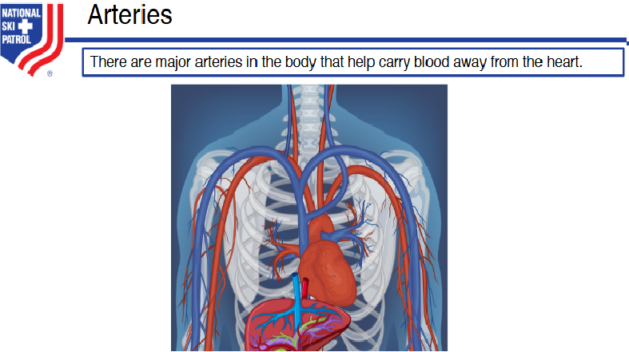
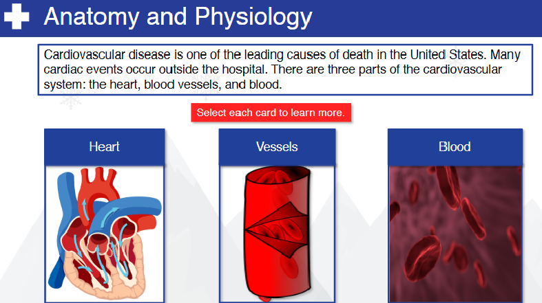
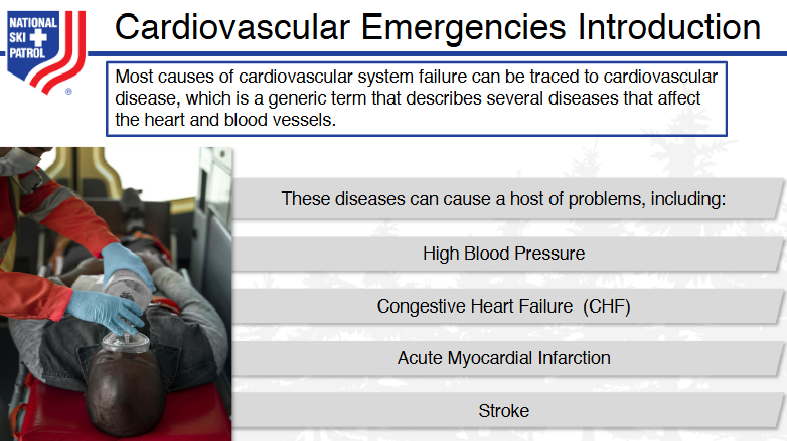
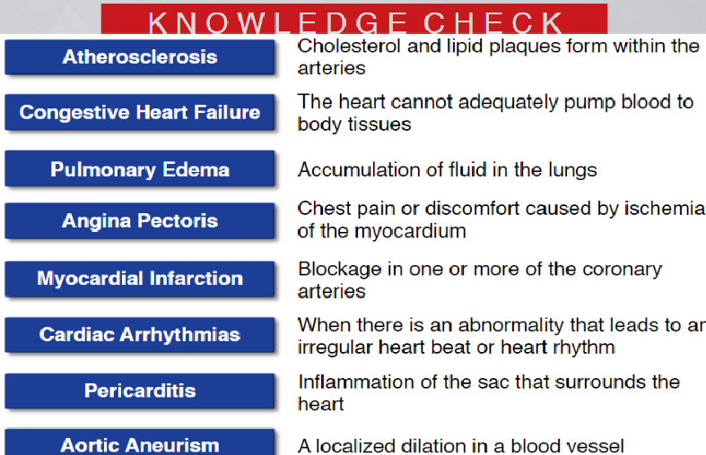
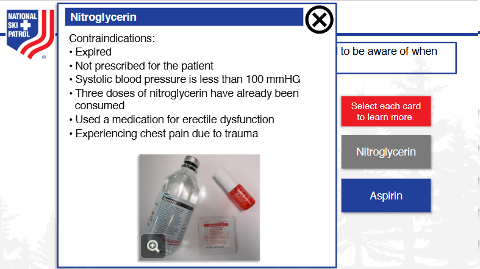
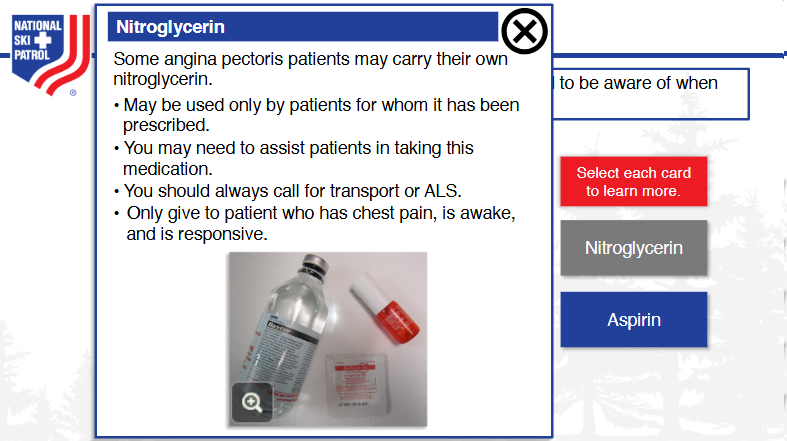
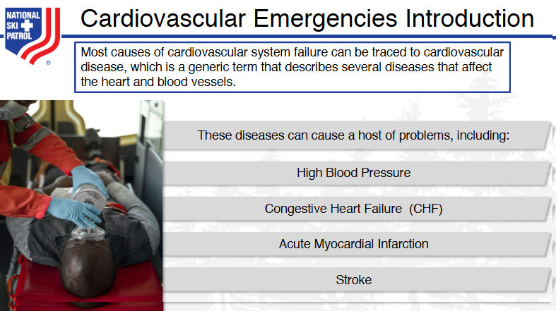
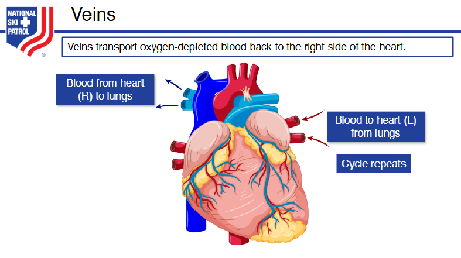

# Nsp Oec Training Chapter 15 - National Ski Patrol - Outdoor Emergency Care chapter 15
Chapter 15: Cardiovascular Emergencies

1. List the arrhythmias associated with sudden cardiac death.
2. Demonstrate how to assess and treat a patient with a cardiovascular emergency.
3. Describe what you should ask a patient who takes a heart medication.
4. Explain what an anticoagulant ("blood thinner") is.
5. List the signs and symptoms for cardiovascular disorders.
6. Give the indications and contradictions of aspirin and nitroglycerin therapy.
7. Describe and demonstrate assisting patient in taking nitroglycerin and/or aspirin.

## 15.1  List the arrhythmias associated with sudden cardiac death.

The **arrhythmias associated with sudden cardiac death (SCD)** are typically life-threatening and involve abnormal heart rhythms that impair the heart’s ability to pump blood effectively. The primary arrhythmias include:

1. **Ventricular Fibrillation (VF)**:
   - A chaotic, disorganized rhythm where the heart’s ventricles quiver instead of pumping blood. It is the most common arrhythmia leading to sudden cardiac death.

2. **Ventricular Tachycardia (VT)**:
   - A fast heart rate originating from the ventricles. If sustained or untreated, it can degenerate into ventricular fibrillation and cause sudden cardiac death.

3. **Bradyarrhythmias**:
   - Abnormally slow heart rates (e.g., heart block or severe bradycardia) can lead to sudden cardiac death by significantly reducing cardiac output.

4. **Asystole**:
   - Also known as "flatline," it refers to the complete absence of any electrical activity in the heart, leading to a lack of cardiac output and sudden death.

5. **Pulseless Electrical Activity (PEA)**:
   - Electrical activity is present, but the heart does not pump effectively, leading to cardiac arrest and sudden death.

These arrhythmias require **immediate intervention**, including **CPR** and **defibrillation**, to restore a normal heart rhythm and prevent sudden death.

## 15.2  Demonstrate how to assess and treat a patient with a cardiovascular emergency.

In a **cardiovascular emergency**, such as a heart attack, cardiac arrest, or other acute cardiac events, rapid assessment and treatment are crucial. Here’s a step-by-step guide on how to **assess and treat** a patient experiencing a cardiovascular emergency:

### **1. Scene Safety and Initial Approach**:
   - **Ensure scene safety** for yourself and the patient.
   - **Approach the patient** and introduce yourself, letting them know you're there to help.
   - **Call for help** or activate the emergency response system (911).

### **2. Initial Assessment (Primary Survey - ABCs)**:

#### **A – Airway**:
   - Check if the patient’s airway is **open and clear**. If they are unconscious, perform a **jaw-thrust** or **head-tilt, chin-lift** maneuver to open the airway.
   
#### **B – Breathing**:
   - **Look, listen, and feel** for breathing.
   - If the patient is not breathing, **begin rescue breathing** or use a **bag-valve mask** (if trained).
   - If breathing is present but labored, administer **oxygen** via a non-rebreather mask (if available).

#### **C – Circulation**:
   - Check the **pulse** at the carotid or radial artery to assess circulation.
   - If there is **no pulse**, immediately begin **CPR** (30 chest compressions, followed by 2 rescue breaths).
   - If an **Automated External Defibrillator (AED)** is available, apply it and follow the device prompts.

### **3. Assess for Specific Cardiovascular Emergencies**:

#### **A. Heart Attack (Myocardial Infarction)**
   **Signs and Symptoms**:
   - **Chest pain or discomfort** (pressure, squeezing, or fullness) that may radiate to the arms, neck, or back.
   - **Shortness of breath**.
   - **Sweating**, nausea, or lightheadedness.
   - **Anxiety** or a feeling of impending doom.

   **Treatment**:
   1. **Call 911** immediately.
   2. **Position the patient** comfortably, usually sitting upright, to ease breathing.
   3. Administer **aspirin** (if the patient is conscious and not allergic) – typically **160-325 mg** of chewable aspirin to thin the blood and improve circulation.
   4. Administer **oxygen** if available and necessary.
   5. Reassure and keep the patient calm, monitoring vital signs while awaiting emergency responders.
   6. If the patient becomes unconscious and pulseless, begin **CPR** immediately.

#### **B. Cardiac Arrest**
   **Signs and Symptoms**:
   - **Sudden collapse**.
   - **Unresponsive** and no pulse.
   - **No breathing** or only gasping breaths (agonal respirations).

   **Treatment**:
   1. **Begin CPR immediately** if the patient is unresponsive and pulseless.
      - Deliver chest compressions at a rate of **100-120 compressions per minute**, at a depth of at least **2 inches** for adults.
      - Allow full chest recoil between compressions.
   2. If an **AED** is available, attach it and follow the prompts. Administer a shock if indicated by the device.
   3. Continue **CPR and defibrillation** cycles until emergency services arrive or the patient regains consciousness.

#### **C. Congestive Heart Failure (CHF) or Pulmonary Edema**
   **Signs and Symptoms**:
   - **Shortness of breath** and difficulty breathing, especially when lying down.
   - **Swollen ankles or legs**.
   - **Fatigue** and weakness.
   - **Coughing** with frothy sputum (fluid buildup in the lungs).

   **Treatment**:
   1. **Call 911**.
   2. Place the patient in a **sitting position**, preferably with legs dangling, to reduce the workload on the heart.
   3. Administer **oxygen** if available.
   4. Monitor the patient’s condition closely while waiting for EMS to arrive.

### **4. Ongoing Monitoring**:
   - Continuously assess **airway, breathing, and circulation (ABCs)**.
   - Monitor vital signs: **pulse rate, respiratory rate**, and **blood pressure** if possible.
   - **Reassure and comfort** the patient. Anxiety can worsen the cardiovascular condition.

### **5. Hand Over to EMS**:
   - Provide emergency medical responders with a brief **report** including:
     - The patient’s **symptoms and condition**.
     - Time of **onset** of symptoms.
     - **Interventions** performed (CPR, AED use, aspirin administration, oxygen therapy).

---

### **Demonstration Example (Heart Attack)**:
1. A patient is complaining of severe chest pain and shortness of breath.
2. You assess the patient’s **airway, breathing, and circulation** and determine they are alert but in distress.
3. **Call 911**.
4. Position the patient **sitting upright** to ease breathing.
5. Administer **160-325 mg of aspirin** (if the patient is not allergic).
6. Provide **oxygen** if available and monitor the patient’s condition while waiting for emergency help.
7. If the patient collapses and becomes unresponsive, immediately start **CPR** and use an **AED**.

### **Key Points**:
- **Call for help early**: Don’t delay activating emergency medical services (911).
- **Administer CPR and defibrillation**: For cardiac arrest, immediate action is critical.
- **Monitor and comfort**: Reassure the patient and continue to assess airway, breathing, and circulation.
- **Medications**: Administer aspirin if a heart attack is suspected and there are no contraindications.

Quick, decisive actions during a cardiovascular emergency can save lives. Proper assessment, early intervention, and continuous monitoring are essential until professional help arrives.

## 15.3  Describe what you should ask a patient who takes a heart medication.

When speaking with a patient who takes heart medication, it’s important to gather information that helps assess their condition and understand how their medication impacts their cardiovascular health. Here are key questions to ask:

### **1. What heart condition do you take the medication for?**
   - This helps identify whether they have conditions like high blood pressure, heart failure, arrhythmias, or a history of heart attacks, guiding your assessment.

### **2. What heart medications are you taking?**
   - Ask for the specific names and doses of their medications, such as **beta-blockers**, **ACE inhibitors**, **statins**, **blood thinners**, or **nitroglycerin**. Knowing this can help determine the effects of their medication.

### **3. When did you last take your heart medication?**
   - This helps determine if they have taken their medication as prescribed or if they have missed a dose, which could contribute to their current symptoms.

### **4. Have you noticed any side effects from the medication?**
   - Some heart medications can cause side effects like dizziness, fatigue, or swelling, which may indicate a problem or require adjustments.

### **5. Do you carry any medications with you, such as nitroglycerin?**
   - If they carry **nitroglycerin** for angina, ask when they last used it and whether it helped relieve their symptoms.

### **6. Have your symptoms changed since starting the medication?**
   - Understanding whether their symptoms (e.g., chest pain, shortness of breath) have improved, worsened, or stayed the same can indicate how well their medication is managing their condition.

### **7. Are there any medications you've been told to avoid?**
   - Certain medications or over-the-counter drugs can interact with heart medications, so knowing if they need to avoid specific substances is important.

### **8. Have you experienced any recent episodes of dizziness, fainting, or palpitations?**
   - These symptoms can indicate potential issues with their heart medication, such as low blood pressure or arrhythmias, and may require immediate attention.

By asking these questions, you gain critical information about the patient’s heart condition, medication regimen, and any potential complications. This helps ensure appropriate care and informs emergency responders or healthcare providers if further intervention is needed.

## 15.4  Explain what an anticoagulant ("blood thinner") is.

An **anticoagulant**, commonly referred to as a "blood thinner," is a type of medication that helps prevent the formation of **blood clots** or slows the growth of existing clots. Anticoagulants do not actually "thin" the blood, but they work by interfering with the blood's natural clotting process.

### **How Anticoagulants Work**:
- Blood clots form through a series of chemical reactions in the body, where platelets and clotting factors create a solid mass to stop bleeding.
- Anticoagulants disrupt these processes by inhibiting certain **clotting factors** (proteins in the blood), making it harder for clots to form.

### **Common Anticoagulants**:
- **Warfarin (Coumadin)**: Works by blocking vitamin K, which is needed to make some clotting factors.
- **Heparin**: Given by injection, it acts quickly to prevent clot formation.
- **Direct oral anticoagulants (DOACs)**: Examples include **apixaban (Eliquis)**, **rivaroxaban (Xarelto)**, and **dabigatran (Pradaxa)**, which work directly on specific clotting factors.

### **Why Anticoagulants Are Used**:
- To prevent blood clots in people with certain medical conditions, such as:
  - **Atrial fibrillation (AFib)**: An irregular heartbeat that can cause clots to form in the heart.
  - **Deep vein thrombosis (DVT)**: Clots in the veins, typically in the legs.
  - **Pulmonary embolism (PE)**: A clot that travels to the lungs.
  - **Stroke prevention**: For people at high risk of blood clots that could lead to a stroke.
  - **Post-surgical care**: To prevent clots after certain surgeries.

### **Precautions**:
- Patients on anticoagulants are at a higher risk of **bleeding**, as the blood takes longer to clot.
  - Avoid activities that may lead to injury.
  - Monitor for signs of excessive bleeding (e.g., bruising, blood in urine, or prolonged bleeding from cuts).

Anticoagulants are critical for preventing serious complications from blood clots, but they must be carefully managed due to the increased risk of bleeding.

## 15.5  List the signs and symptoms for cardiovascular disorders.

Here are the common **signs and symptoms of cardiovascular disorders**:

### **1. Chest Pain or Discomfort (Angina)**
   - **Description**: A feeling of pressure, tightness, or squeezing in the chest, often described as discomfort rather than sharp pain.
   - **Associated With**: Heart attack (myocardial infarction), angina, or coronary artery disease (CAD).

### **2. Shortness of Breath (Dyspnea)**
   - **Description**: Difficulty breathing or feeling breathless, especially during exertion or while lying down.
   - **Associated With**: Heart failure, heart attack, and valve disorders.

### **3. Palpitations**
   - **Description**: Sensation of rapid, fluttering, or irregular heartbeats.
   - **Associated With**: Arrhythmias such as atrial fibrillation or ventricular tachycardia.

### **4. Fatigue or Weakness**
   - **Description**: Persistent tiredness or weakness, especially during physical activity.
   - **Associated With**: Heart failure, cardiomyopathy, or coronary artery disease.

### **5. Dizziness or Lightheadedness**
   - **Description**: Feeling faint or unsteady, often associated with sudden drops in blood pressure or poor blood flow.
   - **Associated With**: Arrhythmias, heart failure, and valve disorders.

### **6. Swelling (Edema)**
   - **Description**: Swelling in the legs, ankles, or abdomen due to fluid retention.
   - **Associated With**: Heart failure or cardiomyopathy.

### **7. Rapid or Slow Heart Rate (Tachycardia or Bradycardia)**
   - **Description**: Abnormally fast or slow heartbeats, potentially leading to inadequate blood flow.
   - **Associated With**: Arrhythmias, heart block, or heart failure.

### **8. Syncope (Fainting)**
   - **Description**: Sudden loss of consciousness due to reduced blood flow to the brain.
   - **Associated With**: Arrhythmias, heart block, or aortic valve disorders.

### **9. Coughing or Wheezing**
   - **Description**: Persistent cough or wheezing, particularly when lying down.
   - **Associated With**: Heart failure, where fluid buildup occurs in the lungs (pulmonary edema).

### **10. Nausea or Vomiting**
   - **Description**: Feeling sick or vomiting, sometimes associated with chest discomfort.
   - **Associated With**: Heart attack, particularly in women.

### **11. Sweating (Diaphoresis)**
   - **Description**: Unexplained, excessive sweating, often cold and clammy.
   - **Associated With**: Heart attack or other cardiovascular emergencies.

### **12. Cyanosis (Bluish Skin)**
   - **Description**: A bluish discoloration of the skin, lips, or fingernails due to poor oxygenation.
   - **Associated With**: Heart failure, congenital heart defects, or severe respiratory/cardiovascular conditions.

### **13. Pain in Other Areas**
   - **Description**: Pain radiating to the **arms, neck, jaw, back**, or **upper abdomen**.
   - **Associated With**: Heart attack (referred pain from the heart).

These signs and symptoms often suggest an underlying cardiovascular disorder and may require immediate medical attention, particularly in emergencies such as heart attack, heart failure, or arrhythmias.

## 15.6  Give the indications and contradictions of aspirin and nitroglycerin therapy.

### **Aspirin Therapy**:

#### **Indications**:
Aspirin is used in emergency situations to help reduce clot formation during cardiovascular events. Its primary use is for suspected heart attacks or chest pain (angina) related to cardiovascular issues.
1. **Suspected Myocardial Infarction (Heart Attack)**: Helps prevent further clotting and reduces the severity of heart attack by inhibiting platelets.
2. **Chest Pain of Cardiac Origin (Angina)**: Aspirin can help reduce the risk of blood clot formation in coronary arteries.
3. **History of Cardiovascular Disease**: Used as a preventive measure in patients with a history of heart attack, stroke, or other forms of heart disease.

#### **Contraindications**:
Aspirin should not be used in certain situations where it may cause harm or worsen the condition.
1. **Allergy to Aspirin or NSAIDs**: Patients with a known allergy to aspirin or nonsteroidal anti-inflammatory drugs (NSAIDs) should not take it.
2. **Active Bleeding or Risk of Bleeding**: Aspirin inhibits clotting, so it should not be given to patients with active gastrointestinal bleeding, recent surgeries, or known bleeding disorders.
3. **Peptic Ulcer Disease**: It may worsen stomach ulcers and lead to internal bleeding.
4. **Asthma Sensitivity**: Some asthmatic patients may experience aspirin-induced asthma or bronchospasm.
5. **Children with Viral Infections**: Risk of **Reye’s syndrome**, a rare but serious condition.

---

### **Nitroglycerin Therapy**:

#### **Indications**:
Nitroglycerin is used to alleviate chest pain and improve blood flow in certain cardiac conditions.
1. **Chest Pain (Angina)**: Nitroglycerin relaxes and dilates blood vessels, reducing the heart's workload and relieving chest pain due to angina.
2. **Suspected Myocardial Infarction (Heart Attack)**: Helps improve blood flow to the heart muscle by dilating coronary arteries.
3. **Heart Failure with Pulmonary Edema**: Nitroglycerin can reduce the strain on the heart by lowering blood pressure and reducing fluid buildup in the lungs.

#### **Contraindications**:
Nitroglycerin should not be used in situations where it could cause a dangerous drop in blood pressure or interact with other medications.
1. **Hypotension (Low Blood Pressure)**: Nitroglycerin lowers blood pressure, so it should not be given to patients with systolic blood pressure below **90 mmHg** or those who are in **shock**.
2. **Recent Use of Erectile Dysfunction Medications**: Medications like **sildenafil (Viagra)**, **tadalafil (Cialis)**, or **vardenafil (Levitra)** can cause a dangerous drop in blood pressure if combined with nitroglycerin.
3. **Severe Bradycardia or Tachycardia**: Nitroglycerin can worsen certain arrhythmias or lead to cardiovascular collapse.
4. **Right Ventricular Infarction**: Nitroglycerin may worsen hypotension in patients with right ventricular infarction by reducing preload.
5. **Increased Intracranial Pressure**: Nitroglycerin may exacerbate increased intracranial pressure and should be avoided in patients with head trauma or recent stroke.

---

### **Summary**:
- **Aspirin** is indicated for heart attacks and angina but contraindicated in cases of bleeding, aspirin allergies, or asthma sensitivity.
- **Nitroglycerin** is indicated for angina and heart attack but contraindicated in cases of low blood pressure, recent erectile dysfunction medication use, or right-sided heart attack. Always assess a patient's condition and history before administering these medications.

## 15.7  Describe and demonstrate assisting patient in taking nitroglycerin and/or aspirin.

Here’s a step-by-step guide on how to **assist a patient in taking nitroglycerin or aspirin** during a cardiovascular emergency such as a suspected heart attack or angina. These steps will help ensure the patient receives appropriate treatment while awaiting emergency medical assistance.

---

### **Assisting a Patient in Taking Nitroglycerin**:

#### **Steps**:
1. **Ensure it's indicated**:
   - Confirm that the patient is experiencing **chest pain of cardiac origin** (angina) or symptoms of a heart attack, such as pressure, tightness, or discomfort in the chest.
   - Verify the patient has **prescribed nitroglycerin** and is not allergic to it.

2. **Check for Contraindications**:
   - Ask the patient:
     - Have they taken **erectile dysfunction medications** (e.g., Viagra, Cialis) within the last **24-48 hours**?
     - Do they have **low blood pressure**? (Avoid if systolic BP is below **90 mmHg** or they are hypotensive.)
   - Ensure the patient is **conscious** and can follow instructions.

3. **Administer Nitroglycerin**:
   - Nitroglycerin is typically administered **sublingually** (under the tongue) as a tablet or spray.
   - **Instruct the patient**:
     - Place the **tablet under the tongue** and let it dissolve without chewing or swallowing it.
     - If using the **spray**, assist the patient in spraying one dose **under the tongue**. Avoid shaking the spray bottle before use.
   - Have the patient **sit or lie down** during administration to avoid fainting or dizziness from the drop in blood pressure.

4. **Monitor for Response**:
   - Wait **5 minutes** after the first dose. If the pain persists and there are no contraindications (e.g., very low BP), administer another dose (up to a maximum of **3 doses** within 15 minutes).
   - **Call 911** or ensure emergency services are en route if you haven’t already done so.

5. **Monitor Blood Pressure and Symptoms**:
   - Keep an eye on the patient’s **blood pressure**. Nitroglycerin can cause hypotension, so be cautious.
   - Continue monitoring the patient for side effects, such as **headache, dizziness**, or worsening symptoms.

---

### **Assisting a Patient in Taking Aspirin**:

#### **Steps**:
1. **Ensure it's indicated**:
   - Confirm that the patient is experiencing symptoms of a heart attack (e.g., chest pain, shortness of breath, or nausea) or that they are at risk of a heart attack and **aspirin is not contraindicated**.
   - Verify the patient has no **allergy to aspirin**.

2. **Check for Contraindications**:
   - Ask the patient:
     - Do they have a **history of aspirin allergy** or sensitivity to **NSAIDs**?
     - Do they have any **active bleeding** (e.g., from peptic ulcers) or a known bleeding disorder?
     - Have they experienced a recent **stroke or head injury**?

3. **Administer Aspirin**:
   - If indicated, assist the patient in taking **160-325 mg of aspirin** (usually 1 regular-strength or 4 baby aspirin tablets).
   - **Instruct the patient**:
     - **Chew** the aspirin thoroughly before swallowing it (even if it’s not a chewable tablet). This ensures rapid absorption.
   - Provide the patient with a small amount of **water** to help swallow the aspirin, if needed.

4. **Monitor for Response**:
   - After the patient takes aspirin, continue to monitor their condition while waiting for emergency medical help.
   - Reassure the patient and keep them calm and comfortable while monitoring for signs of improvement or worsening.

---

### **Demonstration Example (Nitroglycerin)**:
1. A patient is experiencing chest pain. After confirming it's cardiac-related and the patient has prescribed nitroglycerin, you check for contraindications (e.g., recent use of erectile dysfunction drugs).
2. You assist the patient in **placing a nitroglycerin tablet under the tongue**, instructing them to let it dissolve.
3. While waiting, you **monitor their blood pressure** and reassess their pain after 5 minutes. If the pain persists, you assist in giving a second dose.

---

### **Demonstration Example (Aspirin)**:
1. A patient is showing signs of a possible heart attack (chest pain, sweating, nausea). You check that they are not allergic to aspirin and do not have a history of active bleeding disorders.
2. You assist them in taking **160-325 mg of aspirin** (preferably **chewed**).
3. You continue to monitor the patient while waiting for emergency responders.

---

### **Key Points**:
- **Nitroglycerin** is used for chest pain relief, but check blood pressure and contraindications before administering.
- **Aspirin** is used to prevent further clotting during a suspected heart attack, but avoid giving it if the patient has an aspirin allergy or active bleeding.
- Always ensure **911 is called** for emergency medical help in both scenarios, as these medications are short-term interventions while awaiting professional care.

These steps ensure that patients are safely assisted in taking nitroglycerin or aspirin during cardiovascular emergencies, improving their chances of a positive outcome.

## Key Terms 
 1. **Acute Myocardial Infarction** - Also known as a heart attack, it occurs when blood flow to part of the heart is blocked, causing heart muscle damage. 
  2. **Angina Pectoris** - Chest pain or discomfort caused by reduced blood flow to the heart muscle, typically a symptom of coronary artery disease. 
  3. **Aorta** - The largest artery in the body, responsible for carrying oxygen-rich blood from the heart to the rest of the body. 
  4. **Aortic Aneurysm** - A bulge or dilation in the wall of the aorta, which can rupture and lead to life-threatening bleeding. 
  5. **Arrhythmia** - An abnormal heart rhythm that can cause the heart to beat too fast, too slow, or irregularly. 
  6. **Asystole** - A state of no cardiac electrical activity, also known as flatline, where the heart stops beating. 
  7. **Atherosclerosis** - A condition where plaque builds up in the arteries, narrowing them and reducing blood flow to the heart and other organs. 
  8. **Automated External Defibrillator** - A portable device that checks the heart's rhythm and can deliver a shock to restore a normal rhythm in cases of sudden cardiac arrest. 
  9. **Cardiopulmonary Resuscitation (CPR)** - An emergency procedure performed to manually preserve brain function and blood circulation in a person experiencing cardiac arrest. 
  10. **Congestive Heart Failure (CHF)** - A chronic condition where the heart cannot pump blood effectively, leading to fluid buildup in the lungs and other tissues. 
  11. **Coronary Arteries** - The arteries that supply oxygen-rich blood to the heart muscle. 
  12. **Coronary Artery Disease** - A disease caused by the buildup of plaque in the coronary arteries, reducing blood flow to the heart. 
  13. **Defibrillation** - The use of a controlled electric shock to restore a normal heart rhythm in cases of life-threatening arrhythmias like ventricular fibrillation. 
  14. **Hypertension** - High blood pressure, a condition where the force of the blood against the artery walls is too high. 
  15. **Hypotension** - Low blood pressure, a condition where blood flow to organs is inadequate, leading to dizziness, fainting, or shock. 
  16. **Ischemia** - A condition where there is insufficient blood flow to an organ or tissue, leading to oxygen deprivation and damage. 
  17. **Myocardium** - The muscular tissue of the heart responsible for contracting and pumping blood. 
  18. **Pericarditis** - Inflammation of the pericardium, the protective sac surrounding the heart, causing chest pain and other symptoms. 
  19. **Pulmonary Edema** - A condition where excess fluid accumulates in the lungs, often as a result of congestive heart failure. 
  20. **Sudden Cardiac Arrest (SCA)** - An abrupt loss of heart function, breathing, and consciousness, typically due to an electrical disturbance in the heart. 
  21. **Ventricular Tachycardia** - A fast heart rate that starts in the heart's lower chambers (ventricles) and can lead to ventricular fibrillation or sudden cardiac arrest. 
  22. **Ventricular Fibrillation** - A life-threatening arrhythmia where the ventricles quiver instead of pumping blood, leading to cardiac arrest. 
  23. **Ventricular Assist Device** - A mechanical pump used to support heart function and blood flow in people with weakened hearts. 
 
## Getting Started
To get started with the **Nsp Oec Training Chapter 15** solution repository, follow these steps:
1. Clone the repository to your local machine.
2. Install the required dependencies listed at the top of the notebook.
3. Explore the example code provided in the repository and experiment.
4. Run the notebook and make it your own - **EASY !**
    
## Solution Features
- Easy to understand and use  
- Easily Configurable 
- Quickly start your project with pre-built templates
- Its Fast and Automated

## Notebook Features

The goal of this solution is to **Jump Start** your development and have you up and running in 30 minutes. 

- **Self Documenting** - Automatically identifes major steps in notebook 
- **Self Testing** - Unit Testing for each function
- **Easily Configurable** - Easily modify with **config.INI** - keyname value pairs
- **Includes Talking Code** - The code explains itself 
- **Self Logging** - Enhanced python standard logging   
- **Self Debugging** - Enhanced python standard debugging
- **Low Code** - or - No Code  - Most solutions are under 50 lines of code
- **Educational** - Includes educational dialogue and background material
    
## List of Figures
                            
    

## Github https://github.com/JoeEberle/ - Email  josepheberle@outlook.com 
    

    